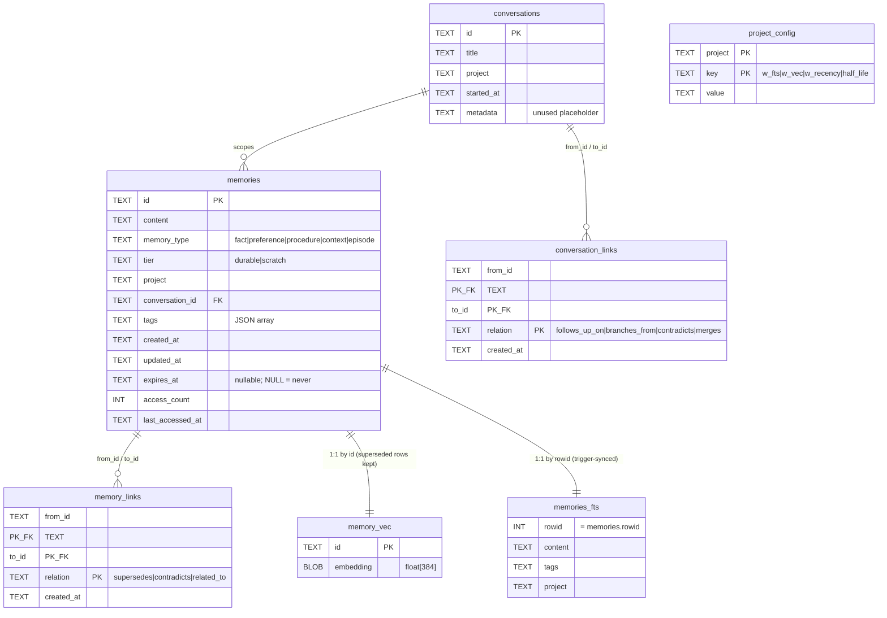

# rekal data model

This is the source-of-truth reference for the SQLite schema rekal stores
its memories in. Every table, column, index, trigger, virtual table, and
the relationships between them. Keep this file in sync with
`rekal/adapters/sqlite_adapter.py`.

> **Why this exists.** The schema has grown three orthogonal axes —
> *type* (semantic), *tier* (lifecycle), *links* (graph) — plus two
> sidecar virtual tables (FTS5, vector). It is small enough to fit in
> one head but not small enough to fit in zero. This doc is the head.

---

## Mental model

A `memory` is the atomic unit. Each row carries:

- **identity** — `id` (16-hex UUID prefix)
- **content** — the distilled, caveman-compressed text
- **semantic axis** — `memory_type` (fact / preference / procedure / context / episode)
- **lifecycle axis** — `tier` (durable / scratch) + optional `expires_at`
- **scope** — `project` and/or `conversation_id`
- **provenance** — `created_at`, `updated_at`, `access_count`, `last_accessed_at`
- **categorization** — `tags` (JSON array)

Around it sit:

- **two indexes on the same row** — full-text (FTS5) and dense vector
  (sqlite-vec). Kept in sync via triggers and a parallel-write in
  `db.store`.
- **a memory→memory graph** (`memory_links`) for *supersedes*,
  *contradicts*, *related_to*.
- **a conversation→conversation graph** (`conversation_links`) for
  *follows_up_on*, *branches_from*, *contradicts*, *merges*.
- **a thin per-project key/value table** (`project_config`) for scoring
  weights overrides.



---

## Tables

### `memories` — the primary entity

```sql
CREATE TABLE IF NOT EXISTS memories (
    id TEXT PRIMARY KEY,
    content TEXT NOT NULL,
    memory_type TEXT NOT NULL DEFAULT 'fact',
    tier TEXT NOT NULL DEFAULT 'durable'
        CHECK (tier IN ('durable', 'scratch')),
    project TEXT,
    conversation_id TEXT REFERENCES conversations(id),
    tags TEXT,
    created_at TEXT NOT NULL DEFAULT (datetime('now')),
    updated_at TEXT NOT NULL DEFAULT (datetime('now')),
    expires_at TEXT,
    access_count INTEGER NOT NULL DEFAULT 0,
    last_accessed_at TEXT
);
```

**Columns**

| Column | Type | Default | Notes |
|---|---|---|---|
| `id` | TEXT | — | 16-hex from `uuid4().hex[:16]` |
| `content` | TEXT | — | Distilled fact. Caveman-compressed. 1–2 sentences. |
| `memory_type` | TEXT | `'fact'` | Enum: `fact`, `preference`, `procedure`, `context`, `episode`. **Validated in Python (`MemoryType` Literal), not at the DB layer** — no CHECK on this column. |
| `tier` | TEXT | `'durable'` | `durable` (long-term) or `scratch` (transient). DB-enforced via CHECK. |
| `project` | TEXT | NULL | Free-form scope. NULL = global memory. |
| `conversation_id` | TEXT | NULL | FK → `conversations.id`. NULL = unscoped. **REFERENCES is documentary only — see [FK enforcement](#foreign-key-enforcement).** |
| `tags` | TEXT | NULL | JSON-encoded `list[str]`. NULL = no tags. Decoded by `parse_tags`. |
| `created_at` | TEXT | `datetime('now')` | ISO-8601 UTC, `YYYY-MM-DD HH:MM:SS`. Used by recency scoring. |
| `updated_at` | TEXT | `datetime('now')` | Bumped by `db.update`. Not used in scoring today. |
| `expires_at` | TEXT | NULL | ISO-8601 UTC. NULL = never. Hard-deleted by `sweep_expired`; lazily filtered by visibility queries. |
| `access_count` | INT | `0` | Bumped by `db.search` every time a row is returned. |
| `last_accessed_at` | TEXT | NULL | Bumped by `db.search`. |

**Indexes**

```sql
CREATE INDEX idx_memories_expires_tier ON memories(expires_at, tier);
```

- `idx_memories_expires_tier` — leftmost column is `expires_at` so
  `sweep_expired` (filters on `expires_at` only) can use it. The
  trailing `tier` column is reserved for future SQL-level tier filtering.

**Constraints**

The table-level CHECK ``CHECK (tier = 'durable' OR expires_at IS NOT NULL)``
forbids the immortal-scratch state on rows inserted into newly created
DBs. Because SQLite has no ``ALTER TABLE … ADD CHECK``, DBs migrated
from the pre-CHECK schema are *not* retro-fitted — see
[Migrations](#migrations). The Python layer (`memory_store_scratch`)
enforces the same invariant on writes regardless.

**Tier semantics**

| Tier | Default | `expires_at` | Visible to |
|---|---|---|---|
| `durable` | yes | NULL (always) | search, timeline, topics, build_context.memories |
| `scratch` | only via `memory_store_scratch` | required by CHECK on fresh DBs; required by Python on all DBs | same — but expired rows hidden by lazy filter, hard-deleted by `sweep_expired` |

The two axes — `memory_type` (semantic) and `tier` (lifecycle) — are
intentionally orthogonal. A `scratch` row can be any `memory_type`. A
`durable` row never has `expires_at`.

**Visibility filter** — `(expires_at IS NULL OR expires_at > datetime('now'))`.
Applied two different ways depending on the call site:

- **In SQL** for `memory_timeline` and `memory_topics` — predicate sits
  in the `WHERE` clause directly.
- **In Python** for `db.search` and `db.memory_similar` — vec/fts
  return candidate IDs first (over-fetched at `limit * 3`), then
  `db.get(id)` resolves the row and Python drops expired hits before
  scoring. `build_context` inherits the Python path because it calls
  `db.search` internally.

Raw access (`get`, `memory_health`, `memory_conflicts`,
`memory_related`, `prune`) deliberately keeps expired rows visible.

---

### `conversations` — session container

```sql
CREATE TABLE IF NOT EXISTS conversations (
    id TEXT PRIMARY KEY,
    title TEXT,
    project TEXT,
    started_at TEXT NOT NULL DEFAULT (datetime('now')),
    metadata TEXT
);
```

**Columns**

| Column | Type | Default | Notes |
|---|---|---|---|
| `id` | TEXT | — | 16-hex via `new_id()` |
| `title` | TEXT | NULL | Human label |
| `project` | TEXT | NULL | Inherited by attached memories' query scope, but not enforced. |
| `started_at` | TEXT | `datetime('now')` | Used by `conversation_threads` ORDER BY and by `conversation_stale` when no memories exist yet. |
| `metadata` | TEXT | NULL | **Currently unused.** Reserved column. |

**Lifecycle**

- Created explicitly via `db.conversation_start(...)`. No auto-creation.
- `memory_store(..., conversation_id=...)` attaches a memory.
- `conversation_threads` lists recent conversations + memory_count.
- `conversation_stale` lists conversations with no memory-write in N days.

---

### `conversation_links` — conversation graph

```sql
CREATE TABLE IF NOT EXISTS conversation_links (
    from_id TEXT NOT NULL REFERENCES conversations(id),
    to_id   TEXT NOT NULL REFERENCES conversations(id),
    relation TEXT NOT NULL CHECK (relation IN (
        'follows_up_on', 'branches_from', 'contradicts', 'merges'
    )),
    created_at TEXT NOT NULL DEFAULT (datetime('now')),
    PRIMARY KEY (from_id, to_id, relation)
);
```

Directed graph between conversations. `(from_id, to_id, relation)` is
the natural key — same pair with two relations is allowed.

**Relations**

| Relation | Meaning |
|---|---|
| `follows_up_on` | B is a continuation of A |
| `branches_from` | B forks from A (independent diverged copy) |
| `contradicts` | A and B claim incompatible state |
| `merges` | B is a merge of multiple parents |

`conversation_tree(id)` does a BFS over both directions and dedupes by
`(from, to, relation)`.

---

### `memory_links` — memory graph

```sql
CREATE TABLE IF NOT EXISTS memory_links (
    from_id TEXT NOT NULL REFERENCES memories(id),
    to_id   TEXT NOT NULL REFERENCES memories(id),
    relation TEXT NOT NULL
        CHECK (relation IN ('supersedes', 'contradicts', 'related_to')),
    created_at TEXT NOT NULL DEFAULT (datetime('now')),
    PRIMARY KEY (from_id, to_id, relation)
);
```

Directed graph between memories.

**Relations**

| Relation | Meaning | Effect on search |
|---|---|---|
| `supersedes` | `from_id` is the new version of `to_id` | `to_id` is excluded from search results — see [supersession](#supersession). `from_id` is visible. |
| `contradicts` | A and B claim incompatible state | Surfaced by `memory_conflicts`; both still visible in search. |
| `related_to` | Free association | No effect on search; surfaced by `memory_related`. |

**Insertion**

- `db.supersede` inserts `(new, old, 'supersedes')`.
- `db.add_memory_link` inserts arbitrary `(from, to, relation)` with
  `INSERT OR IGNORE` (idempotent).
- `db.delete` cascades manually: `DELETE FROM memory_links WHERE from_id = ? OR to_id = ?`.
- `db.prune` and `db.sweep_expired` cascade likewise.

---

### `project_config` — per-project scoring overrides

```sql
CREATE TABLE IF NOT EXISTS project_config (
    project TEXT NOT NULL,
    key TEXT NOT NULL,
    value TEXT NOT NULL,
    PRIMARY KEY (project, key)
);
```

Keyspace today: `w_fts`, `w_vec`, `w_recency`, `half_life`. Values are
stored as TEXT and coerced to float by Pydantic in
`SqliteDatabase.resolve_weights`. No DB-level enum on `key` —
validation happens in `memory_set_config`.

Precedence chain in `resolve_weights` (highest first):

1. Per-call overrides on `search` / `build_context`
2. Project config (this table)
3. File config from `.rekal/config.yml`
4. `ScoringWeights` field defaults — `0.4 / 0.4 / 0.2 / 30.0`

---

## Virtual tables

### `memories_fts` — FTS5 full-text index

```sql
CREATE VIRTUAL TABLE IF NOT EXISTS memories_fts USING fts5(
    content,
    tags,
    project,
    content='memories',
    content_rowid='rowid'
);
```

External content FTS5: index lives separately, but the actual text is
fetched from `memories` by `rowid`. Keeps the index lean.

**Triggers** keep FTS in lockstep with `memories`:

```sql
CREATE TRIGGER memories_ai AFTER INSERT ON memories ...
CREATE TRIGGER memories_ad AFTER DELETE ON memories ...
CREATE TRIGGER memories_au AFTER UPDATE ON memories ...
```

`memories_au` issues a `delete` then re-inserts so renames/edits stay
indexed correctly.

**Querying**

```sql
SELECT m.id, memories_fts.rank
FROM memories_fts
JOIN memories m ON m.rowid = memories_fts.rowid
WHERE memories_fts MATCH ?
  AND m.id NOT IN (SELECT to_id FROM memory_links WHERE relation = 'supersedes')
ORDER BY memories_fts.rank
```

Queries are sanitized via `quote_fts` — every token wrapped in
phrase-quotes — so user input is treated literally and never as FTS5
operators.

---

### `memory_vec` — sqlite-vec dense index

```sql
CREATE VIRTUAL TABLE IF NOT EXISTS memory_vec USING vec0(
    id TEXT PRIMARY KEY,
    embedding float[384]
);
```

`384` = `BAAI/bge-small-en-v1.5` dimensions. Configurable at create
time via `SqliteDatabase.create(..., dimensions=...)` but fixed per
DB.

**Synchronization**

Unlike FTS, there is **no trigger** on `memory_vec`. Maintenance is
explicit in Python:

- `db.store` — `INSERT INTO memory_vec` after embedding.
- `db.update` — `UPDATE memory_vec SET embedding = ?` if content
  changed.
- `db.delete`, `db.prune`, `db.sweep_expired` — `DELETE FROM
  memory_vec` before deleting from `memories`.
- `db.supersede` — inserts new row; old row's vector stays (it's
  filtered out at query time, not deleted). Vec table grows
  monotonically per supersede chain — only `db.delete` / `db.prune` /
  `db.sweep_expired` ever shrink it.

This is the most failure-prone seam in the schema. Any new method that
inserts into `memories` must also insert into `memory_vec`, and any
method that deletes must do both.

**Querying**

```sql
SELECT id, distance
FROM memory_vec
WHERE embedding MATCH ? AND k = ?
  AND id NOT IN (SELECT to_id FROM memory_links WHERE relation = 'supersedes')
ORDER BY distance
```

`k` = `limit * 3` to over-fetch before tier / project / conversation
filters get applied in Python.

---

## Triggers — full list

| Trigger | When | Effect |
|---|---|---|
| `memories_ai` | AFTER INSERT ON memories | INSERT into `memories_fts` |
| `memories_ad` | AFTER DELETE ON memories | INSERT delete-cmd into `memories_fts` |
| `memories_au` | AFTER UPDATE ON memories | delete + re-insert into `memories_fts` |

There are intentionally no triggers on `memory_vec` — see above.

---

## Foreign-key enforcement

**`PRAGMA foreign_keys` is never set.** SQLite ships with FK
enforcement *off* by default. The `REFERENCES` clauses on
`memories.conversation_id`, `memory_links.{from,to}_id`, and
`conversation_links.{from,to}_id` are **documentation, not
enforcement**.

**Implications**

- An orphaned `memories.conversation_id` will not raise.
- Deleting a `memories` row used by `memory_links` will not cascade —
  Python code in `db.delete` / `db.prune` / `db.sweep_expired` does
  the cascade explicitly.
- A bug in cascade logic shows up as dangling rows, not as a
  constraint violation.

Switching FK enforcement on is technically additive but would require
auditing every delete path and adding `ON DELETE CASCADE` to the
schema.

---

## Migrations

There is no migration framework. Two strategies coexist:

1. **Idempotent CREATEs** — every `CREATE TABLE` / `CREATE INDEX` /
   `CREATE TRIGGER` is `IF NOT EXISTS`. Running the schema on an
   existing DB is a no-op.

2. **`migrate_memories_table`** — for additive ALTERs on the existing
   `memories` table and for one-shot index renames. Reads
   `PRAGMA table_info(memories)` to add missing columns and uses
   `DROP INDEX IF EXISTS` to remove obsolete indexes. Idempotent.
   Currently handles:
   - `tier` and `expires_at` columns (added Apr 2026 with the scratch
     tier).
   - Drop of `idx_memories_tier_expires` and `idx_memories_conv_tier`
     (May 2026 cleanup; replaced by `idx_memories_expires_tier`).

Both run unconditionally inside `SqliteDatabase.create`. Cost on a
migrated DB is one PRAGMA + zero ALTERs + two no-op DROP INDEXes.

**Known limitation: no `ALTER TABLE … ADD CHECK`.** SQLite cannot add
a CHECK constraint to an existing table without a full rebuild
(create-new + copy + drop + rename). The current schema includes
`CHECK (tier = 'durable' OR expires_at IS NOT NULL)` for fresh DBs;
DBs migrated from earlier schemas do not have the constraint at the
SQL layer. The Python write paths (`memory_store_scratch`) enforce
the same invariant on every DB regardless.

If we ever need real schema versioning, `PRAGMA user_version` is the
escape hatch.

---

## Query lifecycles

### `db.store(content, *, ...)`

1. Generate `id`, timestamp, JSON-encode tags.
2. Embed `content` synchronously.
3. `INSERT INTO memories (...)`.
4. `INSERT INTO memory_vec (id, embedding)`.
5. `COMMIT`.
6. FTS5 trigger fires automatically.

### `db.search(query, ...)`

1. Embed query.
2. `memory_vec MATCH` → `{id: distance}`, exclude superseded.
3. `memories_fts MATCH` → `{id: rank}`, exclude superseded.
4. Union candidate IDs.
5. For each, `db.get(id)` and Python-filter on
   `expires_at`, `project`, `memory_type`, `tier`, `conversation_id`.
6. Score = `combine_scores(fts, vec, recency, weights)`.
7. Bump `access_count` + `last_accessed_at`.
8. Sort by score desc, slice to `limit`.

### `db.build_context(query, ...)`

Two filtered searches with independent budgets so the durable tier
cannot crowd out scratch and vice versa:

1. `db.search(query, tier='durable', limit=limit, ...)`.
2. `db.search(query, tier='scratch', limit=scratch_limit, ...)` —
   skipped when `scratch_limit == 0`.
3. `db.memory_conflicts(project=...)` for any contradictions.
4. Timeline summary from min/max `created_at` across both lists.
5. Returns `ContextResult{memories: durable, scratch, conflicts,
   timeline_summary}`.

### `db.supersede(old_id, new_content, ...)`

1. `db.get(old_id)` → fail loud if missing.
2. Insert new memory inheriting tier/tags/project/conversation/expiry
   from old unless overridden.
3. Insert new vector.
4. Insert link `(new, old, 'supersedes')`.
5. Old row stays in DB; query layers filter it out via the supersede
   subquery.

### `db.sweep_expired()`

1. `SELECT id FROM memories WHERE expires_at <= datetime('now')`.
2. `DELETE FROM memory_vec WHERE id IN (...)`.
3. `DELETE FROM memory_links WHERE from_id IN (...) OR to_id IN
   (...)`.
4. `DELETE FROM memories WHERE expires_at <= datetime('now')`.
5. Returns count. Called once per MCP server start.

### `conversation_tree(id)`

BFS over `conversation_links` in **both** directions, deduping by
`(from_id, to_id, relation)`. Returns the connected component
containing `id`.

---

## Invariants enforced in Python (not in SQL)

| Invariant | Where |
|---|---|
| `memory_type ∈ {fact, preference, procedure, context, episode}` | `MemoryType` Literal in `models.py`, validated by Pydantic at MCP boundary. |
| `tier ∈ {durable, scratch}` | DB CHECK + `MemoryTier` Literal. Belt-and-braces. |
| Scratch memories have non-NULL `expires_at` | Enforced by `CHECK (tier='durable' OR expires_at IS NOT NULL)` on fresh DBs. DBs migrated from pre-CHECK schemas rely on `memory_store_scratch` writing `expires_at` unconditionally — see [Migrations](#migrations). |
| Tags are JSON-encoded `list[str]` | `db.store` / `db.update` JSON-encode; `parse_tags` decodes. Bad JSON falls back to `[]`. |
| Vector dim matches `memory_vec` declaration | `FastEmbedder.dimensions` passed to `SqliteDatabase.create`. Mismatch → vec0 raises at insert. |
| Timestamps are `'YYYY-MM-DD HH:MM:SS'` UTC strings | `now_utc()`. Compared lexicographically — works because format is fixed-width. |
| All SQL strings are static literals | `AGENTS.md` rule, not enforced by tooling. No f-strings, no concatenation, no `%` formatting on SQL. Only parameterized `?`. |

---

## Known weaknesses

- **FK enforcement off** — orphans possible if a code path forgets to
  cascade.
- **No DB-level CHECK on `memory_type`** — relies on Pydantic at the
  edge.
- **`conversations.metadata` is unused** — placeholder for future use.
  Pick a use or drop the column on a follow-up migration; carrying
  it forever is the worst of both.
- **Pre-CHECK DBs accept immortal scratch** — DBs created before the
  table-level CHECK landed do not enforce the
  `(tier='scratch' → expires_at IS NOT NULL)` invariant at the SQL
  layer. `memory_store_scratch` enforces it on writes regardless.
- **No `ON DELETE CASCADE`** — every cascading delete is hand-written.
- **`memory_vec` has no trigger** — every memory mutation must
  remember to update the vec table. Bug-prone.
- **Supersede grows `memory_vec` monotonically** — old vector rows
  are left behind so the supersede-exclusion subquery can find them
  via `memory_links`. A long supersede chain accumulates dead
  vectors until the chain root is `delete`d or `prune`d.
- **`memory_links.relation` has no index** — every vec/fts search runs
  `id NOT IN (SELECT to_id FROM memory_links WHERE relation='supersedes')`
  as a correlated subquery. Fine while link counts are small; revisit
  when supersede chains get deep or `related_to` grows.
- **No schema version** — we rely on `IF NOT EXISTS` + idempotent
  ALTER. Works today; a real migration framework
  (`PRAGMA user_version` + a runner) would scale better.
- **Recency uses `created_at` only** — `updated_at` and
  `last_accessed_at` are recorded but ignored by scoring.

---

## File map

- Schema literal: `rekal/adapters/sqlite_adapter.py` → `SCHEMA`
- Vector table: `rekal/adapters/sqlite_adapter.py` → `VEC_TABLE_SQL`
- Migration: `rekal/adapters/sqlite_adapter.py` → `migrate_memories_table`
- Models: `rekal/models.py`
- Scoring: `rekal/scoring.py`
- Embedding: `rekal/embeddings.py`
- MCP tool surface: `rekal/adapters/tools/{core,smart_write,conversations,introspection}.py`
